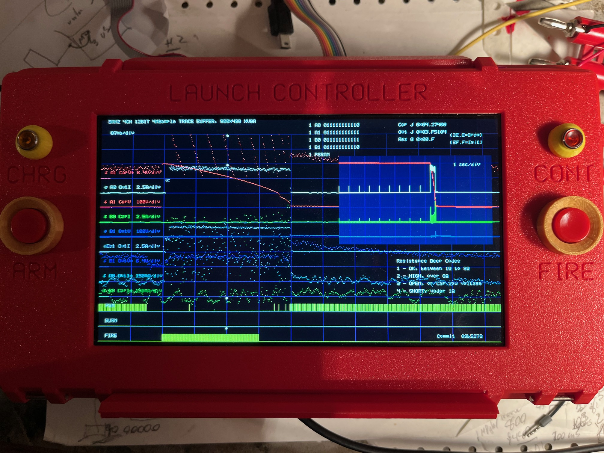
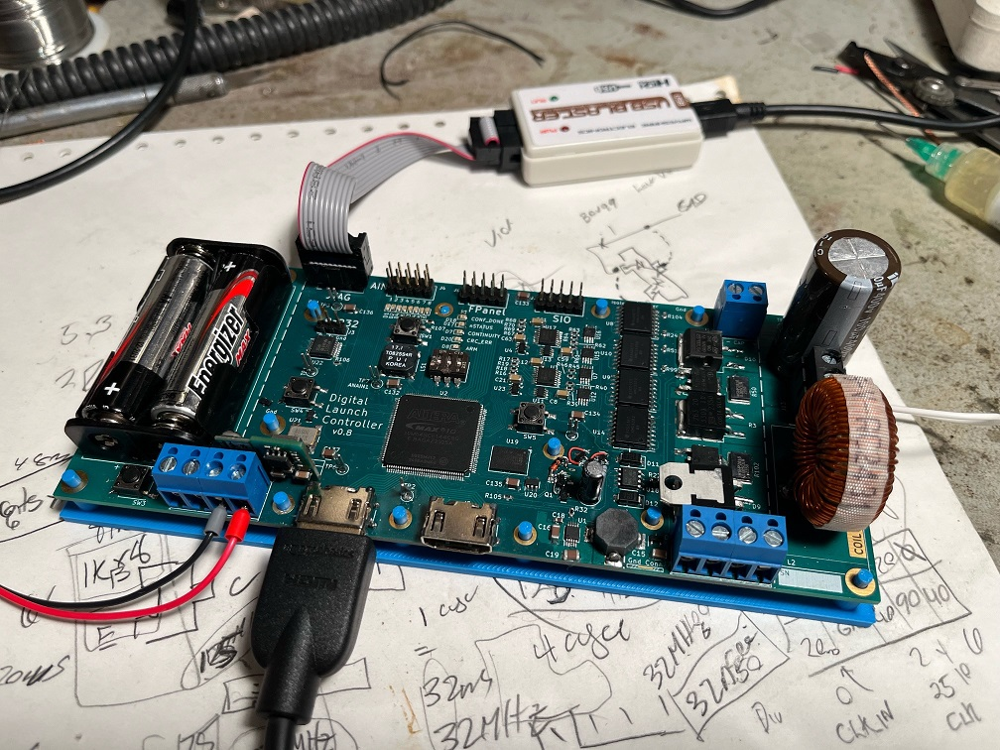
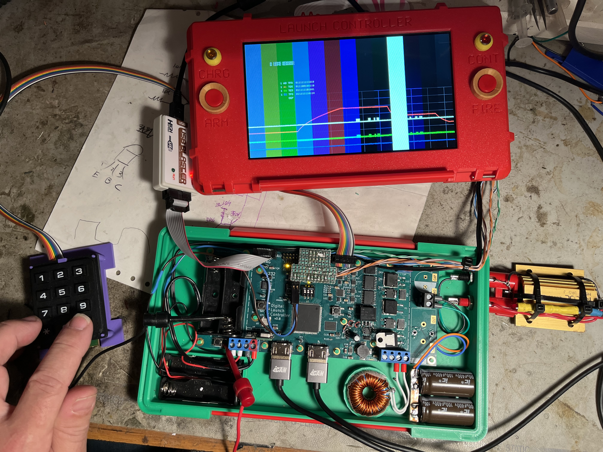

 ### fpga_rocket_launcher

### A ForgeFPGA-1K implementation
Update: A ForgeFPGA implementation. 
I came across ForgeFPGAs which are 3x3mmm low power low cost ($0.50) FPGA chips containing a respectable 1120 logic cells. 
The 24 pins package had the IO needed and the logic cells seemed appropriate for a the launch controllers core functions.
The free tools for synthesis and place-route worked with my verilog code with minor tweaking.
With functional simplification (eg: no hdmi video, no dividers) the tools fit the core launch controller logic gates into 
the ForgeFPGA-1K and generated power and timing reports. 
I then verified the forgefpga verilog by embedding it into my altera max10 fpga launch controller allowing me to view the instrumented interface 
 between the co-synthesized core ForgeFPGA and the real hardware (very nice!).
I plan to use this launch control fpga for an minimalist handheld digital launch controller PCB. It would have connectors for mounting the ForgeFPGA Eval board for development, and would otherwise re-use the ADC and power circuitry interface as needed from the previous controller.

With the size of the FPGA now reduced to basically nothing, a compact size could be looked at. I stopped and considered the shapes limited by the large components: 4xAA, 2x Caps, 1x Coil, and along with output jacks. 3D printing each allowed some ergonomic testing and locating the 2 pairs of buttons and Leds.


# Digital Model Rocket Launch Controller

A FPGA based model rocket digital launch controller.

No embedded CPU, this is Verilog RTL synthesized digital logic.



Showing a bench test using an Estes igniter. Observed low resistance (~ 1ohm) and takes 4 Joules at 4 amps for about 300msec.



[Schematic](fpga_blaster_schem_v0_8.pdf)

### Digital constant current capacitive discharge launch controller.

## Core function

Powered by 4xAA Lithium batteries capable 1A of current. 
When armed, the controller charges a 200uF capactor bank to 320V with a flyback converter giving 10 Joules of stored energy. 
Upon launch, the capacitor is discharged through a 390uH inductor into the igniter.
The discharge is modulated by a FET with a PWM gate drive.
Discharge is digitally current controlled as a buck converter with a setpoint in the range of 2.0 to 6.0 amps.
The set current is maintained over the full capacitor discharge, or until the ignitor burns through and the circuit opens.

The digital control system uses a differential analog front end, used to isolate and instrument the capacitor and output IVs.
12-bit ADCs sample the four signals (cap/out,I/V) which are simultaneously sampled and digitized at 3 Mhz and fed into the digital system.

The PWM signal is generated by a control loop running at 48 Mhz (16x sample rate). 
The control loop models the inductor current based on the PWM signal, ADC capcitor and output voltages (slowly changing), sample rate coil inductance. 
The PWM is turned on when ADC output current falls below a setpoint.
The PWM is turned off when the output current model rises above a setpoint,  
The model used for turn-off to avoid overshoot due to timing accuracy and sample latency.
A stable current pulse is generated limited only by the dropping capacitor voltage with a ripple limited only by the minimum PWM pulse width.

## Extended Functions

Additional uses for FPGA logic and real time ADC data stream can be implemented. These range from simple to Max Headroom.

### Charged LED Hysteresis.

Using the ADC stream include the capacitor voltage, the charge-LED could be operated to reflect the capacitor voltage charge with some hysteresis.
The logic would turn on the charge-LED when the capacitor voltage sample is received and reached 300V, as we want a full charge for launch, 
but would only turn off the charge-LED when the capacitor voltage falls below 50V (<3% energy) as we'ed like to know when it is safe to handle.

```
// Arm is based on vcap with 300v on thresh and 50v off thresh
logic cap_charged;
always @( posedge clk ) begin
	if( reset ) begin
		cap_charged <= 0;
	end else begin
		cap_charged <= ( strobe_d && vcap > (( 300 * 10000 ) / 2005 ) ) ? 1'b1 :
		               ( strobe_d && vcap < (( 50  * 10000 ) / 2005 ) ) ? 1'b0 : cap_charged;
	end
end
```

### Fire Button Debounce and Feedback.

Some dedicated logic to handle the lauch button input is worth while.

To make low cost push button feel nice required: adding debounce logic, and provide audio feedback of its operation. 
To do this debounce counters are used to measure at least 5ms of time before sensing a 'press',
and then generating a fixed 10msec pulse output for logic triggering, and 10msec C5 beep for feedback. 
100ms of release time was required before dectecting another button press. 

Multiple experments and measurements were done to get a basic good enough 'feeling' for this button. The audio feedback worked pleasantly well.

This button also had a long press detect feature to trigger additional functionality. 
If held for 600msec a 2nd signal output would be asserted while held.

### Pulse Energy Accumulation

Ignition energy is a key parameter of igniters. Mensurements
are usefull to check this value.

The instantaneous power (Watts) of the capacitor and outputs can
each be calculated from the ADC samples as E = I * V.

The energy (Joules) over a time period can be accumulated by the sum
of the power measurement.

Using 44 bit sum of product of the unscaled I and V ADC values during ignition period gives allows a 10 Joule range with uJ resolution.
Using the unscaled ADC data elimiates numerical error accumulation. For display the nearest decimal point position was chosen from the 44 bit number
and fixed point hexadecimal coding used for display. 
```
// Acculuate both Cap and Output power products.
always @(posedge clk) begin
	strobe_d <= ad_strobe;
	// P = I * V
   pout[21:0] <= vout[10:0] * iout[10:0];
   pcap[21:0] <= vcap[10:0] * icap[10:0];
	if( strobe_d ) begin
		acc_flag_d <= acc_flag;
		// raw power loaded at flag rise, acculuated during flag, and held afterwards
		eout[43:0] <= ( acc_flag && !acc_flag_d ) ? { 22'b0, pout[21:0] } : ( acc_flag ) ? ({ 22'b0, pout[21:0] } + eout[43:0]) : eout[43:0];
		ecap[43:0] <= ( acc_flag && !acc_flag_d ) ? { 22'b0, pcap[21:0] } : ( acc_flag ) ? ({ 22'b0, pcap[21:0] } + ecap[43:0]) : ecap[43:0];
	end else begin
		acc_flag_d <= acc_flag_d;
		eout[43:0] <= eout[43:0];
		ecap[43:0] <= ecap[43:0];
	end
end
```

Measuring power of both the output and capactor gives insights into the device efficiency and 
some redundancy for measurement validation.

### Continuity Checking

Checking the continuity of an igniter is a resistance measurement to 
check for cases where the circuit is open or shorted.

After the system is armed and waiting for launch, once per second, a 1usec PWM pulse is generated.
Ohms law, R = E / I, is performed on the ADC samples to derive a resistance.

The resistance is averaged and shown to be repeatable over the range 0.4 to 30.0 ohms.

Thresholds are applied to the resistance to decide when the continuity LED is turned on (1.0 to 16 ohms),
and a beep code is generated (A mute dip switch stops the beep codes after the first)

```
1 beep - OK, 1.0 to 8 Ohms
2 beeps - HI, over 8 ohms, but not open
3 beeps - Open circuit,
4 beeps - SHORT circuit maybe, under 1.0 ohms
```
Note: the energy output for this short pulse is accumulated and displayed by the previous function
and usually under 0.25 mJoules which is not enough for ignition.

### HDMI VGA output

Normally on-board LEDs are usefull during development debug to present state to give some insight into
correct operation. Usually there are never enough LEDs as state can get quite involved. 

The next steps usually involve: oscilloscopes, logic analysers, computers and software, however ...

LEDs can be replaced with pixels on an HDMI display. FPGA logic to generate HDMI outputs at XVGA 800x480x60Hz resolution is accomplished
with a 32Mhz pixel clock, and DDR LVDS outputs clocked at 160Mhz giving 320mbit ea for Red, Green and Blue. Digtal counters are used
to generate the video syncronization and maintain the current X and Y locations on the screen.

Connecting an internal signal to a given pixel can be as simple as the logical AND of test signal and desired pixel location, 
with all pels being ORed together to make the video signal
```
assign pel1 = (xcount == 100) & (ycount == 300) & (test_signal1 == 1);
assign pel2 = (xcount == 100) & (ycount == 310) & (test_signal2 == 1);
assign video = pel1 | pel2
```
With some additional logic a font set can be derived giving live text display of binary or hex measurements and dynamic text overlays like:
```
	string_overlay #(.LEN( 9)) _id4 (.clk(hdmi_clk), .reset(reset), .char_x(char_x), .char_y(char_y),
	.ascii_char(ascii_char), .x('h02),.y('h03), .out(id_str[4]), 
	.str(	( zoom == 0 ) ? " 21us/div" :
			( zoom == 1 ) ? " 43us/div" :
			( zoom == 2 ) ? " 85us/div" :
			( zoom == 3 ) ? "170us/div" :
			( zoom == 4 ) ? "340us/div" :
			( zoom == 5 ) ? "680us/div" :
			( zoom == 6 ) ? "1.4ms/div" :
			( zoom == 7 ) ? "2.7ms/div" :
			( zoom == 8 ) ? "5.5ms/div" :
			( zoom == 9 ) ? " 11ms/div" :
			( zoom == 10) ? " 22ms/div" :
			( zoom == 11) ? " 44ms/div" :
			/*zoom == 12)*/ " 87ms/div" ) );
```
Using this method logic was built to allow the display of live values: igniter resistance (ohms), capacitor and output energy (Joules), average ADC binary values, error statuses for ADC channels and PSRAM. Fixed point hex values are used for sake of logic simplicty. Noting that 5 hex digits ~ 1 million is helpful.



### Scrolling Oscilloscope

The 3Mhz ADC samples can have min and max values calculated over longer intervals (1/60s) can be stored
into a 500 sample buffer and plotted and overlayed onto the display giving insight into the coarse
operation of the capacitor charge and discharge without missing a single transient during PWM operation
and allowing sufficient time to visually observer operation. 

This display scrolling is halted 4 seconds after launch to show complete capacitor discharge.

### 32 MBytes Trace Buffer

A PSRAM, or pseudo SRAM, is alow cost ($10), high density (32 Mbytres), high speed (400MBs) sram-like memory, that can connects using only 11 signals. 
It has built in refresh logic, and uses a SPI8 interface for burst access.
A simple controller with an AXI4 interface was developed to configure and 
access the device with 16 byte burst writes, and both 8-byte or 64-byte burst reads.

These PSRAM are only available in ball grid array (BGA) footprints. This was my first home assembled PCB with a BGA. YouTube helped alot for that.

The ADC sampels are stored to a 32 Mbyte circular trace buffer. With 3 Mhz sampling and 64 bits per sample we get 1.3 seconds of storage, which is 
sufficient to capture the full launch operation. 64 bits allows capturing of the 4x 12-bit adc samples, as well as the sampled model (estimated current)
and sampled PWM, and push-button signals as well as an burn-through detect signal.

The buffer is written continuously and only is stopped after launch finished, captureing the full detail from slightly before the launch button is pressed.

### Trace Buffer Display

The 800 samples of data is read from the trace buffer during video blanking and used to plot the sample data multiple scales and colors.
The starting address and stride allows examing the data from very coarse to finest full 3 Mhz detail. 

After launch the fire button is used to step through zoom ranges to see what occured during launch.

### Blipvert

A blipvert is a very brief television advertisement, lasting one second. The term and concept were used in the 1985 film Max Headroom: 20 Minutes into the Future.

HDMI provides a fast and standards compliant way to upload the 32 Mbyte trace buffer to a computer.
The memory is dumped to the RGB video HDMI output, with each visible display line having an memory address
followed by 1 kbyte of data all encoded into the RGB pixels.

This looks like a burst of messy noise, which matched my memory of the blipvert from the film. 

The bipvert is activated by holding down the fire button for at least 1 second and continously dumps the buffer.

Using an HDMI capture card and capturing a second of the video noise gives the entire memory contents,
which can be recovered with a script from the captured video.

#### Blipvert Update #1

The 1st issue is that HDMI capture devices for RGB are costly ($300-$400), but are available
for $20 if a YUV color space is used. That is because the base USB protocol inlcudes support and drivers
for cameras and the cheap HDMI-USB capturee devices only support YUV2 protocol.

So what I planned and did was to switch over to YUV2 during blipvert operation. 
This meant inserting HDMI InfoFrame packets during video blanking, so each viedo frame could be identified
as either RGB24 or YUV2 coded. This swithcing worked.

This raised the 2nd issue was that my awesome and pricy sunlight viewable LCD display only supported the DVI subset of HDMI,
and the presence of InfoFrame packets caused issues. And the HDMI capture device required that the InfoFrames
must always be transmitted (or never transmitted).

The solution was to take advantage of the 2 HDMI ports and simultaneously transmit DVI for the LCD display and HDMI to external devices,
such as the Cheap USB capture device or an LCD display.

### Text Overlay

In addition to the dynamic logic derived text it is useful to have some fixed text overlay.

ROM equivalents for a 5x7 font table and a 16 color text overlay efficiently utilize the FPGA built in SRAMS. 
Unfortuately with this lowest cost (SC) version of the fpga, ROM initialization of the SRAMs is not available,
and the updated device costs 50% more. So logic was added to read the onboard flash and load it into the rom's (SRAMS). 

This text allowed my to display some basic static information without worrying about incremental gate cost if I modified the text.

### Git Commit ID

It is always helpful to be able to trace a running system back to its git commit. 

Some bash and awk scripting was used extract, format, and insert the 7 hex digit git commmit id into the text overlay 
(lower right corner) before the FPGA was compiled. Very handy

## FPGA Selection

The MAX-10 FPGAs from Intel/ALtera were selected as a) free tools were available and b) low cost devices and c) the instant-on (10mSec) boot time.
The 144 pin quad flat pack was chosen as it is hand solderable and probe-able. Devices from 2K to 25K logic cells are avaialable in pin compatible packages.
The free tools support System Verilog design input, and provide support integrating device specific features including differential and DDR IO and PLLs for clock generation. 

The design choice was the Intel Altera 10M04SCE144C8G, breaking down the part number:

```
10M - this family has free software tools.
04 - This was a $20 low cost device, has 4K Logic Elements (LEs) ).
SC - compact(cheap) device, no analog input, limited flash, no rom
E144 - Hand solderable quad flat pack
C - cheap consumer temps only
8G - cheap, slowest speedgrade
```

This 10M04 device also support pin compatibility over a 2 to 25K LE. 

The 10M04 is also a 'limited' device, in that
it is actually an 8K LE device and limited by software to only allow 4K usage. This allow the vendors to sell
their "Floor sweepings", and provides 1/2 cost devices to us. The neat part is that 100% utilization of the 4K LEs is 
then possible as which LEs are used remains flexible, and the interconnect is sized for higher densities, so it can
be fully packed to 99% utilization.

## Free Development Tools 

FPGA Dev Tools : Intel Altera Quartus Prime Lite v23.1

Schematic/PCB  : KiCad 7.0

## Capacitor discharge Pros and Cons

After this experience is a good time to reflect on the trade offs in
capactor discharge launch controllers vs a standard launch controller based with push button.

```
Pros:
+ Current Pulse delivers same power with any cabling
+ safety, can be part of an intrisically safe system
+ Resistance Measurement with 0.1 ohm precision
+ Energy Measurement with 1 uJ precision 
+ Repeatability with constant current with minimal ripple
+ Failure Analysys Data
+ Portable, with small battery
+ Battery Life is extended 
+ Reliability, Feedback gives confidence  

Cons:
- Button - it still needs a push button, and can be replaced by a push button.
- Expensive
- Estes - does not work well with estes igniters
- Complex system
- High Voltage and Arcing
```


